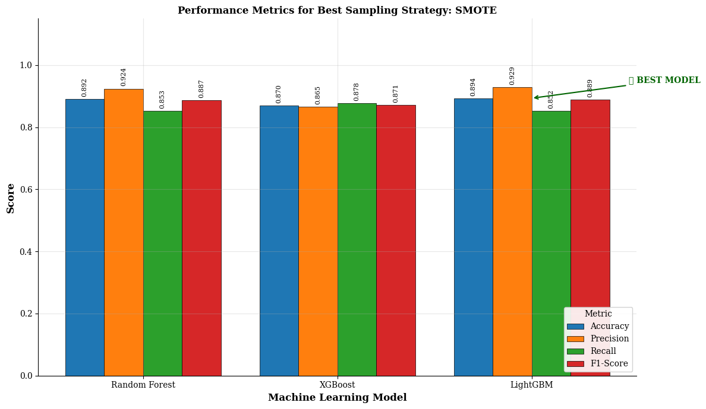

# 🏥 Predicting Early Hospital Readmission in Diabetic Patients Using K-Fold Cross-Validation and Resampling Techniques 

## 📌 Abstract

Hospital readmissions among diabetic patients impose significant clinical and economic burdens. This study presents a structured machine learning pipeline to predict patient readmission outcomes using electronic health records. The approach integrates domain-informed feature engineering, categorical encoding, and robust evaluation via 5-fold cross-validation.

To address class imbalance, Synthetic Minority Over-sampling Technique (SMOTE) is incorporated within the training folds. Multiple classical machine learning models are evaluated under a consistent experimental protocol. The pipeline emphasizes reproducibility, modularity, and research rigor while preserving the original experimental logic.

## 🎯 Problem Statement

The objective is to predict whether a diabetic patient will be readmitted to the hospital based on historical clinical and demographic data.

- **Input:** Patient encounter records
- **Output:** Readmission status (`readmitted`)
- **Task Type:** Supervised Classification

## 🧠 Method Overview

The methodology strictly follows the original notebook pipeline, structured into the following stages:

### 1. Data Preprocessing
- Removal of duplicate patient records (`patient_nbr`)
- Handling missing values (`?` → NaN → row removal)
- Dropping non-informative or leakage-prone features:
  - `encounter_id`, `patient_nbr`, `weight`, `payer_code`, `medical_specialty`

### 2. Feature Engineering

#### Age Transformation
- Age intervals converted into numerical midpoints

#### Admission Type Grouping
- Simplified categorical grouping:
  - Emergency, Urgent, Elective

#### Admission Source Grouping
- Reduced categories:
  - Referral, Emergency, Transfer

#### Diagnosis Clustering
- ICD codes mapped into clinical categories:
  - Circulatory
  - Respiratory
  - Digestive
  - Diabetes
  - Injury
  - Musculoskeletal
  - Genitourinary
  - Neoplasms
  - Other

### 3. Encoding Strategy
- All categorical features encoded using **Label Encoding**

> Note: This mirrors the original notebook implementation and is intentionally preserved for fidelity.

### 4. Handling Class Imbalance
- SMOTE (Synthetic Minority Over-sampling Technique) applied **only on training folds**

### 5. Model Training

The following classical machine learning models are supported:

- XGBoost Classifier
- Random Forest Classifier
- Light GBM Classifier

### 6. Evaluation Protocol

- **Validation Strategy:** 5-Fold Cross-Validation (KFold)
- **Metric:** Accuracy, Precision, Recall, F1 Score, ROC-AUC

For each fold:
1. Splitting data into training and validation sets
2. Applying SMOTE (if enabled) on training data
3. Training the model
4. Evaluation on validation set

Outputs:
- Fold-wise accuracy
- Best-performing fold

---

## 📁 Repository Structure

```

diabetes-readmission-prediction/
│
├── configs/ # Configuration files (optional extension)
├── data/ # Dataset placeholders
├── notebooks/ # Cleaned notebooks
├── src/ # Core pipeline code
├── scripts/ # CLI entrypoints
├── experiments/ # Results and logs
├── tests/ # Unit tests
├── README.md

````

## ⚙️ Installation

### 1. Clone Repository
```bash
git clone https://github.com/your-username/diabetes-readmission-prediction.git
cd diabetes-readmission-prediction
````

### 2. Create Environment

```bash
python -m venv venv
source venv/bin/activate  # Linux/Mac
venv\Scripts\activate     # Windows
```

### 3. Install Dependencies

```bash
pip install -r requirements.txt
```

## 🚀 Usage

### 🔹 Train Model (Single Run)

```bash
python scripts/train.py \
    --data_path data/raw/diabetic_data.csv \
    --model logistic_regression \
    --use_smote
```

---

### 🔹 Run Multi-Model Experiments

```bash
python scripts/run_experiments.py
```

### 🔹 Evaluate Results

```bash
python scripts/evaluate.py
```

## 📊 Results

### 📈 Model Performance (Best Sampling Strategy: SMOTE)



The figure above presents the comparative performance of three classical machine learning models evaluated using 5-fold cross-validation with SMOTE applied to address class imbalance.

#### 🔍 Key Observations

- **LightGBM emerges as the best-performing model**, achieving:
  - **Accuracy:** 0.894  
  - **Precision:** 0.929 *(highest among all models)*  
  - **Recall:** 0.852  
  - **F1-Score:** 0.889  

- **Random Forest** demonstrates strong and balanced performance:
  - Accuracy: 0.892  
  - Precision: 0.924  
  - Recall: 0.853  
  - F1-Score: 0.887  

- **XGBoost** shows comparatively lower performance:
  - Accuracy: 0.870  
  - Precision: 0.865  
  - Recall: 0.878  
  - F1-Score: 0.871  

#### 🧠 Interpretation

- The integration of **SMOTE significantly improves model performance**, particularly for precision-sensitive predictions.
- **LightGBM’s superior precision and overall balance** make it the most reliable model for predicting diabetic patient readmissions in this setup.
- While XGBoost achieves relatively higher recall, its lower precision suggests a higher false-positive rate.

#### 📌 Conclusion

Under the SMOTE resampling strategy, **LightGBM is identified as the optimal model**, offering the best trade-off across all evaluation metrics.

Results are stored in:

```
experiments/results/
├── cv_results.csv
├── all_models_cv.csv
```

Each file contains:

* Fold-wise accuracy
* Model comparison (for multi-model runs)
* Best fold identification

## 🔁 Reproducibility

This repository ensures reproducibility through:

* Fixed random seed across modules
* Deterministic K-Fold splitting
* Consistent preprocessing pipeline
* SMOTE applied strictly within training folds (no leakage)

---

Covered components:

* Data pipeline
* Model training
* Cross-validation logic

## 📦 Requirements

* Python 3.9+
* pandas
* numpy
* scikit-learn
* imbalanced-learn

## 🔮 Future Work

Potential research extensions:

* Replace Label Encoding with One-Hot Encoding or embeddings
* Introduce additional metrics (F1-score, ROC-AUC)
* Perform ablation studies on feature engineering components
* Compare multiple resampling strategies (ADASYN, RandomOverSampler)
* Integrate hyperparameter tuning (GridSearchCV, Optuna)

## 📜 Citation

```bibtex
@misc{diabetes_readmission_ml,
  title={Predicting Hospital Readmission in Diabetic Patients Using Classical Machine Learning},
  author={Your Name},
  year={2026},
  note={GitHub Repository}
}
```

---

## 🙏 Acknowledgements

* [UCI Machine Learning Repository (Diabetes Dataset)](https://www.kaggle.com/datasets/brandao/diabetes/data)
* scikit-learn and imbalanced-learn communities

## 📬 Contact

For research collaboration or queries:

* Email: [Shahzainaslam28@gmail.com](mailto:Shahzainaslam28@gmail.com)
* GitHub: [https://github.com/shahzainaslam11](https://github.com/shahzainaslam11)
